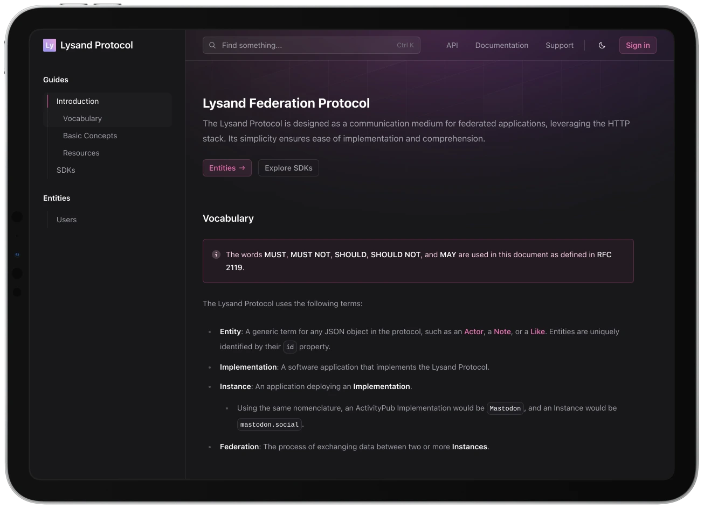

<p align="center">
  <a href="https://versia.pub"></a>
</p>


<h2 align="center">
  <strong><code>Versia Documentation</code></strong>
</h2>

<div align="center">
    
    
    
    
    
    
    
    
    
</div>

<br/>

<p align="center">
    
</p>

## Technologies

- [**`TypeScript`**](https://www.typescriptlang.org/): A typed superset of JavaScript that compiles to plain JavaScript.
- [**`React`**](https://reactjs.org/): A JavaScript library for building user interfaces.
- [**`Next.js`**](https://nextjs.org/): A React framework for building static and dynamic websites.
- [**`MDX`**](https://mdxjs.com/): Markdown for the component era.
- [**`Zustand`**](https://zustand.surge.sh/): A small, fast, and scalable state management library.
- [**`Framer Motion`**](https://www.framer.com/motion/): A production-ready motion library for React.
- [**`FlexSearch`**](https://flexsearch.net/): A full-text search library for JavaScript.

## Installation

This project uses [Bun](https://bun.sh) as a package manager. To install the dependencies, run:

```bash
bun install
```

To start the development server, run:

```bash
bun dev
```

## Contributing

Contributions are welcome! Feel free to open an issue or submit a pull request.

### Licenses

The code in this repository is licensed under the [MIT License](
https://opensource.org/licenses/MIT).

However, the *documentation text* (including the Markdown files in the `app` directory) is licensed under the [Creative Commons Attribution 4.0 International License](https://creativecommons.org/licenses/by/4.0/). You are free to share and adapt the text as long as you provide proper attribution.